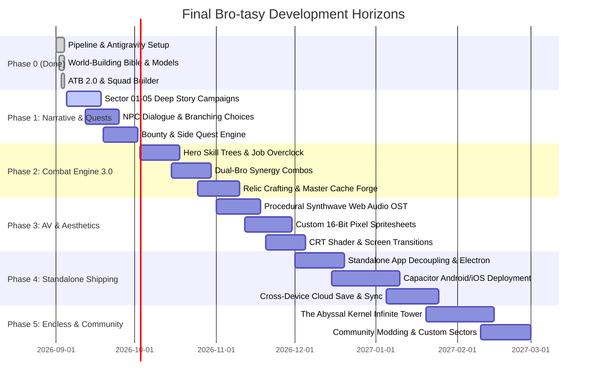

# FINAL BRO-TASY & BRO'GATCHI OS — PRODUCT & ENGINEERING ROADMAP
*Version 1.0.0 — September 2026*
*Authoritative Strategic Roadmap for Final Bro-tasy & Bro OS*

---

## Executive Summary
**Final Bro-tasy** has completed its foundation phase: establishing the Antigravity development pipeline, comprehensive world-building compendium (5 Eras, 6 Heroes, 8 NPCs, 8 Kingdoms, 5 Factions, 5 Cults, 5 Gangs, 7 Code Arts, 18+ Bestiary Records), headless balance simulator (2,500 battles verified), and tactical ATB 2.0 combat engine with squad customizer and in-game world codex.

This roadmap charts the strategic path from the current core engine to a commercially polished, standalone tactical JRPG experience across web, desktop, and mobile.

---

## Roadmap at a Glance

---

## Phase 0: Foundation & Pipeline [COMPLETED]

| Deliverable | Location | Status |
|---|---|---|
| **Antigravity Customization Framework** | `.agents/rules/final-brotasy-canon.md`, `.agents/skills/final-brotasy-pipeline/` | **DONE** |
| **World-Building Bible** | `FINAL_BROTASY_WORLD_BIBLE.md`, `src/.../loreData.ts` | **DONE** |
| **Playable 6-Hero Roster** | Ryan, Chad, Zeke, Sister Nova, Jax, Maya | **DONE** |
| **Companion Pet Familiars** | 7 Pet auras & unique limits (`characters.ts`) | **DONE** |
| **Relic System (6 Archetypes)** | Titanium Heatsink, Overclock Crystal, Quantum Core, Baud Pendant, etc. | **DONE** |
| **Automated Data Validation** | `npm run brotasy:validate` (0 errors across 8 phases) | **DONE** |
| **Headless Combat Simulator** | `npm run brotasy:simulate` (2,500 battle iterations) | **DONE** |
| **Interactive World Codex Modal** | 9 Categorized tabs with search in `FinalBrotasyGame.tsx` | **DONE** |
| **Tactical ATB 2.0 Engine** | Elemental weakness feedback, boss telegraphs, guard mitigation | **DONE** |
| **Squad Builder Screen** | Custom 3-Hero lineup picker with equipped relic selection | **DONE** |

---

## Phase 1: Narrative Campaign & Branching Quests
*Target: Weeks 1–4*

Transform the current linear sector progression into an interconnected narrative campaign:

### 1.1 Multi-Stage Sector Quests & Dungeon Crawling
- **Interactive Mini-Maps**: Node-based dungeon progression within each sector (e.g., *Sector 01: Alleyway Checkpoint → The Fiber Canal → The Ping Lounge → Hegemony Rooftop*).
- **Random Encounters & Environmental Hazards**: Electromagnetic dust storms in Sector 02 causing thermal buildup; sub-zero frost in Sector 03 slowing initial ATB gauges by 25%.
- **Branching Decision Points**: Players can choose covert hacking routes (bypassing combat with Zeke/Maya) or frontal assaults (high XP & loot with Ryan/Jax/Chad).

### 1.2 Interactive NPC Interaction & Side Bounties
- **The Ping Lounge Hub**: Visit Byte-Tender Boris between missions to purchase rumor leads and accept high-reward bounty hunts for rogue mini-bosses.
- **Oracle 404 Hex Prophecies**: Riddles unlocking hidden secret chambers in each sector.
- **Master Cache’s Relic Quests**: Collect raw germanium transistors and broken heatsinks across the wasteland to forge legendary relics.

---

## Phase 2: Combat Engine 3.0 & Deep Strategy
*Target: Weeks 5–8*

Deepen turn-based tactical combat to match premium 16-bit JRPG classics (Chrono Trigger, Final Fantasy VI):

### 2.1 Dual-Bro Synergy Attacks ("Dual Techs")
Unlock synergistic combo skills when two specific heroes both have full ATB / Limit:
- **Ryan + Chad**: *Firewall Cleave* (Heavy thermal shockwave that grants an impenetrable kinetic barrier).
- **Zeke + Maya**: *Zero-Day DDoS* (Deletes 50% enemy defense while inflicting instant glitch bleed).
- **Jax + Sister Nova**: *Anabolic Resuscitation* (Crushes ground with seismic fury while healing all allies).
- **Pet Guardian + Hero**: Special companion ultimate synergies tailored to the active pet.

### 2.2 Hero Talent Trees & Overclock Specializations
- Each hero earns **Code Points (CP)** upon leveling up.
- Branching specialization paths:
  - *Ryan*: **Overclock Samurai** (Pure crit & speed) vs. **Tactical Warlord** (Squad aura buffs & team ATB).
  - *Chad*: **Fortress Bulwark** (Damage reflection & maximum HP) vs. **Battering Ram** (Kinetic stuns & shield offensive).
  - *Zeke*: **Bug Inflictor** (Status ailments & ATB manipulation) vs. **Raw Hex Nuker** (Massive single-target magic bursts).

### 2.3 Interactive Turn Order Queue Timeline
- Surface a visual Grandia/FFX-style turn queue showing upcoming player and enemy action slots.
- Enable tactical turn delay tactics (using Cryo/DDoS skills to bump enemy turns backward on the queue).

---

## Phase 3: Audiovisual Polish & Immersion
*Target: Weeks 9–12*

Upgrade visual fidelity, animation fluidity, and audio design to create a standout sensory experience:

### 3.1 Multi-Channel Procedural Synthwave Web Audio Engine
- **Procedural Synthwave Battle Themes**: Dynamic arpeggiated basslines (120–130 BPM), retro poly-lead chords, and percussion synthesis generated via HTML5 Web Audio API.
- **Adaptive Music Layers**: Music dynamically intensifies when Boss enters enraged phase (<40% HP) or when Limit Break is ready.
- **Sound Effect Redesign**: Stereo-panned critical strike impacts, laser sweeps, shield parry rings, and victory fanfare.

### 3.2 Custom Animated Character & Enemy Spritesheets
- Replace procedural canvas blocks with custom 16-bit animated pixel sprite sheets:
  - 4-frame idle breathing animations.
  - Windup, slash, and recovery frames for melee and spell casts.
  - Flinch and defeat collapse animations for all 18+ bestiary monsters.

### 3.3 Retro Display Options
- Optional CRT scanline overlay and chromatic aberration toggle.
- Screen distortion transitions when entering battles ("Swirl", "Mosaic Shatter", "Phosphor Fade").

---

## Phase 4: Standalone Architecture & Mobile/Steam Shipping
*Target: Weeks 13–16*

Package Final Bro-tasy and Bro OS as an independent, commercial-ready software distribution:

### 4.1 Standalone App Decoupling
- Isolate `brogatchi-virtual-pet` into a dedicated repository / standalone build artifact independent of Perimeter Suite.
- Maintain shared pipeline tooling via `.agents/` and Antigravity SDK.

### 4.2 Cross-Platform Desktop & Mobile Distribution
- **Desktop (Windows/Mac/Linux)**: Electron or Tauri wrapper with native frameless windowing, tray minimization, and desktop pet companion widget.
- **Mobile (Android/iOS)**: Capacitor packaging with touch gesture controls, offline local storage persistence, and battery-optimized frame throttling.

### 4.3 Cloud Save & Cross-Platform Sync
- Cryptographically signed local save exports (JSON file backup/restore).
- Optional decentralized or cloud save sync across desktop and mobile devices.

---

## Phase 5: Endless Void & Community Ecosystem
*Target: Weeks 17+*

Long-term player retention, infinite endgame loop, and user-generated content:

### 5.1 The Abyssal Kernel: Procedural Infinite Tower
- Procedurally generated levels past Sector 05.
- Randomized rogue-lite modifiers: "Thermal Overload (+50% Fire dmg, -20% Max HP)", "Buffer Overflow (Random status every 3 turns)".
- Superboss gauntlets against corrupted legacy operating systems.

### 5.2 Antigravity Pipeline Community Modding
- Standardized JSON schema for community-created Sectors, Enemies, Relics, and Heroes.
- Automated validation CLI (`npm run brotasy:validate --mod=my_custom_sector.json`) allowing fans to author balanced community expansions that adhere to the canonical rules.

---

## Verification & Quality Gates

Each phase requires passing strict quality thresholds before promotion:

1. **Automated Data Validation**: Zero broken links, unhandled IDs, or missing codex references (`npm run brotasy:validate`).
2. **Headless Combat Balance**: Minimum 2,500 simulation battles ensuring balanced win-rate curves across all party combinations (`npm run brotasy:simulate`).
3. **Clean Production Builds**: 100% TypeScript type safety and Vite build compliance (`npm run build`).
4. **Browser & Device Testing**: Full visual verification with automated screenshot and video artifacts recorded via Antigravity Browser Subagents.
